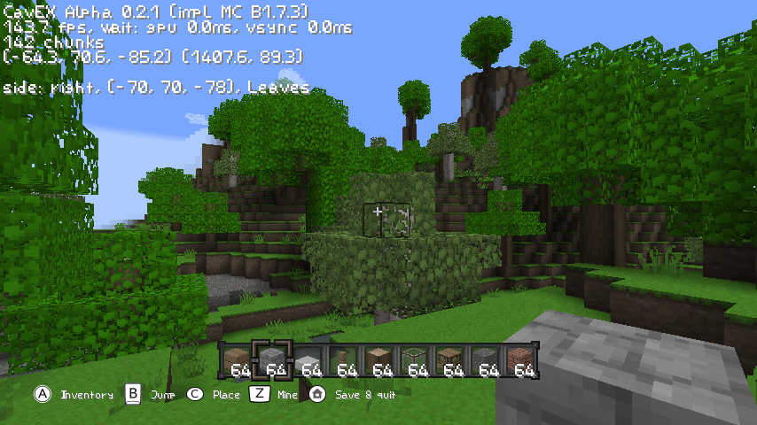

# CavEX

*Cave Explorer* is a Wii homebrew game with the goal to recreate most of the core survival aspects up until Beta 1.7.3. Any features beyond *will not* be added.

---

**Features**
* great performance on Wii (about 60fps)
* 5 chunk render distance currently
* load any beta world save
* nearly all blocks added, except redstone related
* many items from the original
* correct light propagation
* ambient occlusion on blocks

---

**Planned features** *(in no particular order, not complete)*
* main menu
* generation of new chunks
* biome colors
* ~~player physics~~
* ~~inventory management~~
* ~~block placement~~ and destruction logic
* ~~(random)~~ block updates
* ~~item actions~~
* real texture pack support
* Beta 1.7.3 multiplayer support

## Screenshot


*(from the PC version)*

## Build instructions

Before building the project, you need to checkout its dependencies. Luckily, this is as easy as running the command

```bash
git submodule update --init
```

This will download all the needed libraries. You still need to download the system libraries for the target machine you are building for, as explained in the respective subsections.

### Wii

For the Wii platform you need to install the [devkitPro](https://devkitpro.org/wiki/Getting_Started) Wii/Gamecube environment. Additionally install zlib using pacman of devkitPro.

```bash
dkp-pacman -S wii-dev ppc-zlib
```

To build, simply run make in the root directory. You might need to load the cross compiler env first (required e.g. if you use [fish](https://fishshell.com/) instead of bash).

```bash
source /etc/profile.d/devkit-env.sh
make
```

There should then be a .dol file in the root directory that your Wii can run. To copy the game to your `apps/` folder, it needs to look like this:
```
cavex
├── assets
│   ├── terrain.png
│   ├── items.png
│   ├── anim.png
│   ├── default.png
│   ├── gui.png
│   └── gui2.png
├── saves
│   ├── world
│   └── ...
├── boot.dol
├── config.json
├── icon.png
└── meta.xml
```

### GNU/Linux

The game can also run on any PC with support for OpenGL 2.0 and played with keyboard and mouse.

Building requires the following additional libraries, which you can install with your system package manager: `zlib`, `glfw3` and `glew`. You can then use CMake and gcc to build. The already existing Makefile is for the Wii platform only and might be removed sometime later.

```bash
mkdir build_pc
cd build_pc
cmake ..
make
```

Please also copy the fragment and vertex shaders from `resources/` next to your `assets/` directory.
